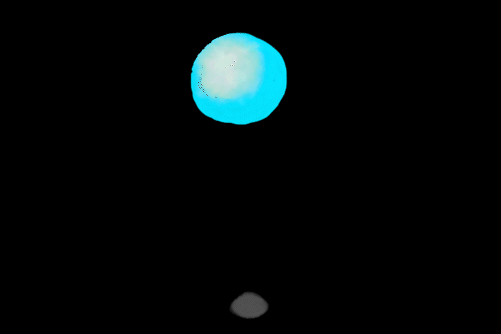

## Online Portfolio

[Home](https://hibah-ali.github.io/)    |   [Email](mailto:hibahalei@gmail.com) 

<hr>

```
Animation with Adobe Fresco, Photoshop, & After Effects
```
Squash, stretch, and pose:



###### 720x480p 

<hr>

Walk cycles:

Lower body                 |  Lower + upper body        |
:-------------------------:|:-------------------------:
            |   |

###### 720x480p, 720x480p 
<hr>

Timing and secondary action:


###### 720x480p 

<hr>

|This demonstrates multiple concepts: <br /> anticipation, overlap, and follow through + squash, stretch, and pose: |   |
|:-------------------------:|:-------------------------:|

###### 720x480p 
<hr>


```
Identity Sculpture (IB art)
``` 


###### 3x3x2.5 in. 
_"Gift"_. <br /> A representation of an aspect of my personal identity; my name, which means "Gift". <br /> Medium: clay. 

<hr>


```
Personal Theme with 3D Assemblage (IB art)
```
Spray paint Assemblage


Page 1                     |  Page 2                  |
:-------------------------:|:-------------------------:
          |         |


|Page 3                    |  Page 4
:-------------------------:|:-------------------------:
|         |  


Final work:


###### 20x16 in.
Medium: spray paint, styrofoam, stencils created from paper, toothpick.

<hr>

```
Freedom
```

Page 1                     |  Page 2                  | 
:-------------------------:|:-------------------------:
          |         |  

|Page 3                    |  Final work 
:-------------------------:|:-------------------------:
|         |  18x12 in.


Medium: charcoal, colored pencil, marker, paper support.

<hr>

```
Linocut Printmaking
```


###### 5x7 in., 5x7 in., 5x7 in.
_"The Elemental Dragons"_

Medium: elements of design, acryllic paint, colored pencil.

<hr>

```
Watercolor 
```

Seascape                   |  Textile               |
:-------------------------:|:-------------------------:
 12x19 in.|         |
Medium: watercolor and paper.| Medium: colored pencils, watercolor pencils, watercolor, fabric support.|

<hr>

```
Charcoal and Zentangle
```


###### 9x12, 9x12 in.
Medium: charcoal, sharpie pen.
<hr>

```
Surrealism
```


###### 12x18 in. 
Medium: graphite pencil and paper.

<hr>


```
Radial Balance
```


###### 15.5x11 in.
Medium: colored pencils, pen, tracing paper, paper.
<hr>

```
Pointillism
```


###### 12x18 in.
medium: markers, paper.
<hr>


```
Crochet
```


<hr>

```
Post Impressionist Artist: Paul Cezanne
```


###### 12x9.5 in. 
This work was inspired by Paul Cezanne's _Still Life with Apples and Pears_. The formalism of his artwork consisted of some elements that I used such as plates, pitcher, and the fruits. The value was low with lots of shading which I added to my work. The techniques used were layering colors to build up surfaces and outlining the forms for emphasis.
Medium: Acryllic paint.

<hr>

```
AutoCAD: Computer-Aided Designs
```


Floor plans                 | Furniture
|:-------------------------:|:-------------------------:|
| <br />  <br /> |  <br />  <br />  |


Replicating art:
  <br /> (from www.artfire.com) | |
:-------------------------:|:-------------------------:


Redesign:

 | |
:-------------------------:|:-------------------------:
Features that needed improvement: more efficient crosswalk for students & buildings closer for easier access and transportation. <br /> Other considerations: avoid cutting down trees, create a design that would be efficient to build. | Improvements: utilized the three roads for each parking lot in each school to prevent traffic blockage, easier transportation for students.  |

<hr>

```
Depicting a theme: "The Race Against Time"
```
 <br /> 8x12 in. |  This hourglass embodies life. The red liquid in the hourglass signifies blood, and the crack represents the fleeting nature of life and how it is finite. <br />  Medium: fire for burn effect, colored pencil, pencil.|
:-------------------------:|:-----------------------------------------------------------------------------------:

 <br /> 20x16 in. <br />  Medium: pencil, watercolor pencils, paint marker, drywall board. 
 
<hr>
