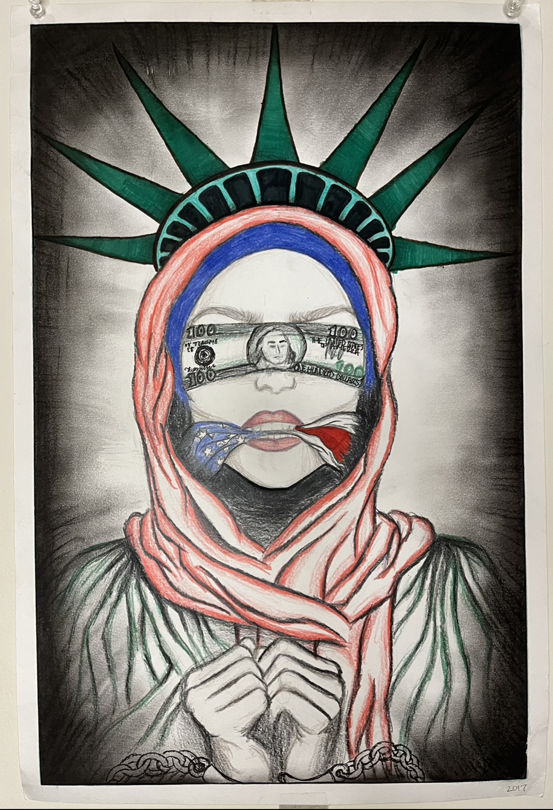

## Online Portfolio
[Home](https://hibah-ali.github.io/)    |   [Email](mailto:hibahalei@gmail.com) 

<hr>
<hr>

### Experimentation:
```
Watercolor Seascape
```


Medium: watercolor and paper.
<hr>

```
Surrealism
```


Medium: graphite pencil and paper.
<hr>

```
Textile
```


Medium: colored pencils, watercolor pencils, watercolor, fabric support.

<hr>

```
Radial Balance
```


Medium: colored pencils, pen, tracing paper, paper.
<hr>

```
Linocut Printmaking
```

_"The Elemental Dragons"_

Medium: elements of design, acryllic paint, colored pencil.

<hr>

```
Exploring a Theme: "The Race Against Time"
```

Medium: fire for burn effect, colored pencil, pencil.

Medium: pencil, watercolor pencils, paint marker, drywall board.

<hr>

```
Pointillism
```

medium: markers, paper.
<hr>

```
Post Impressionist Artist: Paul Cezanne
```

- This work was inspired by Paul Cezanne's _Still Life with Apples and Pears_. The formalism of his artwork consisted of some elements that I used such as plates, pitcher, and the fruits. The value was low with lots of shading which I added to my work. The techniques used were layering colors to build up surfaces and outlining the forms for emphasis.
Medium: Acryllic paint, colored pencil

<hr>

```
Charcoal and Zentangle
```

Medium: charcoal, sharpie pen.
<hr>

```
Crochet
```


<hr>


```
Freedom
```

Page 1                     |  Page 2                  | 
:-------------------------:|:-------------------------:
          |         |  

|Page 3                    |  Final work
:-------------------------:|:-------------------------:
|         | 

Medium: charcoal, colored pencil, marker, paper support.

<hr>
<hr>

### IB Art
```
Personal Theme with 3D Assemblage
```
Spray paint Assemblage


Page 1                     |  Page 2                  |
:-------------------------:|:-------------------------:
          |         |


|Page 3                    |  Page 4
:-------------------------:|:-------------------------:
|         | 


Final work:


Medium: spray paint, styrofoam, stencils created from paper, toothpick.

<hr>

```
Identity Sculpture
``` 


_"Gift"_

- This sculpture represents an aspect of my personal identity, which is my name, meaning "Gift".

Medium: clay. 

<hr>
<hr>

### ART (BA)

```
Adobe Fresco/ Photoshop and After Effects
```


<hr>

Anticipation, overlap, and follow through:


<hr>

Walk cycles

Feet                       |  Upper Body              |
:-------------------------:|:-------------------------:
            |  |

<hr>

Timing and secondary action:


<hr>

```
AutoCAD
```
Floor plan & furniture:

-                 |  -                 |
:-------------------------:|:-------------------------:
         |         |


Primitive shapes:

<hr>
