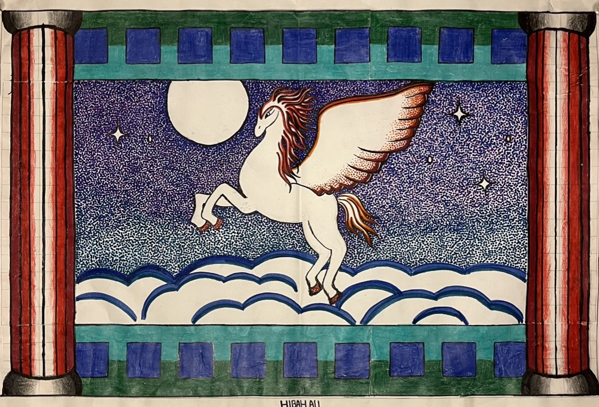

### Hibah
[Home](https://hibah-ali.github.io/)    |   [Email](mailto:hibahalei@gmail.com)   |   [About](https://hibah-ali.github.io/)


##
###Textile


Medium: colored pencils, watercolor pencils, watercolor, 
fabric


## Paul Cezanne fruits experimentation

This work was an exploration on still life genre and cre
Acryllic paint, colored pencil
 

### 


## A Series
_"The Race Against Time"_


## Watercolor 
Landscape


## Charcoal

Won the art competition Second Place

## Spray paint Assemblage


### Pointillism


## Art Show
### Charcoal


### Printmaking
_"The Elemental Dragon"_


### Graphic Design
## AutoCAD


### Sketchbook Pages


### Poverty (A Series) 
```
 IMG_2064.jpg IMG_2065.jpg


```
