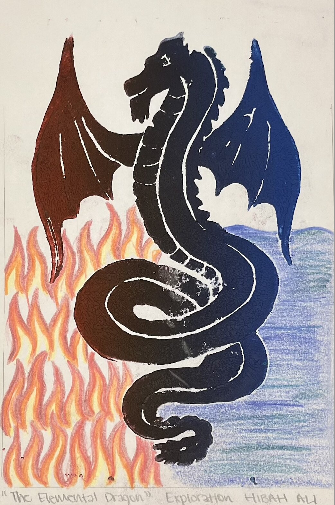

```
[Home](https://hibah-ali.github.io/)    |   [Email](https://hibah-ali.github.io/)   |   [About](https://hibah-ali.github.io/)
```
_hibahalei@gmail.com_


## Computer Aided Designs:


## Medium: AutoCAD Software

## Fabric


### Medium: colored pencils, watercolor pencils, watercolor, 
fabric

## Spray paint Assemblage


## Printmaking

###
acryllic paints, 


## Paul Cezanne fruits experimentation


This work was an exploration on still life genre and cre


Acryllic paint, colored pencil


### Charcoal


###
The race against time

### Poverty (A Series)
```



```
